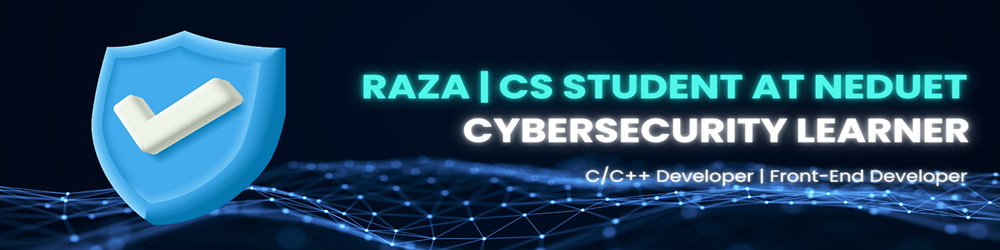

<!-- 🔗 This README appears on my GitHub profile! -->

# Muhammad Raza  
**Cybersecurity & Cloud Security Professional | SOC Analyst Experience | GitHub: RazaJavaid2004 | LinkedIn: Muhammad Raza**

## 🧠 About Me  

👋 Hi, I'm **Muhammad Raza** 

I'm a Computer Science undergraduate at NED University, driven by a mission to secure digital systems and strengthen organizational resilience. My focus lies in **cybersecurity, ethical hacking, cloud security, and compliance frameworks**.  

I design and document **modular security toolkits**, build cryptographic suites, and explore **DevSecOps pipelines** that integrate security into every stage of development. With hands‑on SOC Analyst internships and certifications in cybersecurity, I bring both technical depth and regulatory awareness to my work.  

- 🎓 CS Student @ NEDUET  
- 🔐 SOC Analyst & Cybersecurity Internships  
- 🌐 Exploring Cloud Security, Infrastructure as Code, and Policy as Code  
- 📜 Skilled in compliance frameworks: NIST, PCI DSS, SOC 2, HIPAA, FedRAMP  
 
- 🌱 Currently learning:

  
  
  

---

## 🛡️ Cyber Academy SOC Analyst Internship

🎓 **Role**: SOC Analyst Intern (Level 1)  
🏢 **Organization**: Cyber Academy  
📅 **Duration**: June 2025 – September 2025  
🌐 **Location**: Remote  
🔍 **Focus Areas**: SIEM tools (IBM QRadar, Wazuh), log analysis, alert triage, incident response workflows, playbook documentation   

  

---

## 🛡️ CodeAlpha Cybersecurity Internship

🎓 **Role**: Cybersecurity Intern  
🏢 **Organization**: CodeAlpha  
📅 **Duration**: Oct 2025 – Jan 2026  
🌐 **Location**: Remote  
🔍 **Focus Areas**: Ethical Hacking, Secure Protocols, Python, C++, GitHub Documentation  

  

---

## 📊 GitHub Statistics

  <!-- Streak Stats -->
  

  <!-- Activity Graph -->
  

  <!-- Visitor Counter -->
  

  <!-- Badges Summary -->
  
  
  
  

---

## 🛠️ Skills & Tools

| Domain | Tools |
|--------|-------|
| **Programming** | C, C++, Python, Assembly |
| **Cybersecurity** | Ethical Hacking, Cryptography (RSA, AES, DES), Wireshark, Scapy |
| **Cloud & DevOps** | Terraform, GitHub Actions, Azure |
| **Compliance** | NIST, PCI DSS, SOC 2, HIPAA |
| **Developer Tools** | VS Code, Git, GitHub, Linux |

---

## 🚀 Featured Projects

### 🛡️ ASM Credential Validator
Low‑level authentication workflow built in Assembly using DOS interrupts and register‑level string validation.  
**Impact:** Demonstrates secure credential handling at the system level.  
**Tech Stack:** Assembly | DOS Interrupts  
🔗 [View Repository](https://github.com/RazaJavaid2004/ASM-Credential-Validator)

---

### 🌐 Basic Network Sniffer
Packet sniffer built with Python and Scapy. Captures live traffic, logs summaries with timestamps, and mimics SOC‑style monitoring.  
**Impact:** Practical tool for traffic analysis and SOC training.  
**Tech Stack:** Python | Scapy  
🔗 [View Repository](https://github.com/RazaJavaid2004/CodeAlpha_Basic-Network-Sniffer)

---

### 🔒 RSA, AES & DES Encryption Suite
Cryptography toolkit implementing RSA, AES, and DES for secure data handling and algorithm comparison.  
**Impact:** Educational resource for comparing symmetric vs. asymmetric encryption.  
**Tech Stack:** C++ | Modular Class Design  
🔗 [View Repository](https://github.com/RazaJavaid2004/CXX-Language-Course/tree/main/Projects/OOP%20Project)

---

### 📂 PITP Cybersecurity & Ethical Hacking
Hands‑on exercises and labs focused on penetration testing, ethical hacking, and secure protocol design.  
**Impact:** Reinforces practical cybersecurity skills through structured labs.  
🔗 [View Repository](https://github.com/RazaJavaid2004/PITP-Cybersecurity-and-Ethical-Hacking)

---

### 📜 Google Cybersecurity Professional
Repository documenting coursework and applied exercises from the Google Cybersecurity Certificate.  
**Impact:** Showcases structured learning and applied security practices.  
🔗 [View Repository](https://github.com/RazaJavaid2004/Google-Cybersecurity-Professional)

---

### 📅 Daily Task Notifier
Desktop app that displays daily routine tasks at startup with recurrence logic and priority sorting.  
**Impact:** Demonstrates ability to design cross‑platform utilities with scheduling features.  
**Tech Stack:** C++, Qt Creator 
🔗 [View Repository](https://github.com/RazaJavaid2004/Daily-Task-Notifier)

---

### 📝 Labs to PDF
Automation tool that compiles lab programs, executes them, and generates formatted PDF reports.  
**Impact:** Streamlines documentation and workflow efficiency.  
**Tech Stack:** Python | PDF Automation  
🔗 [View Repository](https://github.com/RazaJavaid2004/labs-to-pdf)

---

## 📜 Compliance Frameworks

  
  
  
  
  

---

## 📜 Certifications

- Google Cybersecurity Certificate  
- Cyber Security and Ethical Hacking (NED Academy & SITD Government of Sindh)  
- SOC Analyst Essentials (Cyber Academy)  
- CCSC (Hack and Fix)  
- Microsoft Learn: Cloud Computing & Cloud Benefits  
- Prompt Hackers Masterclass (Datacrumbs)  

  
  
  
  
  
  
  

---

## 🎖️ Credly Badges

<!-- START_CREDLY_BADGES -->
<!-- END_CREDLY_BADGES -->

---

## 📫 Connect with Me
  

---

_Thanks for visiting my profile! Let’s secure the future together._
